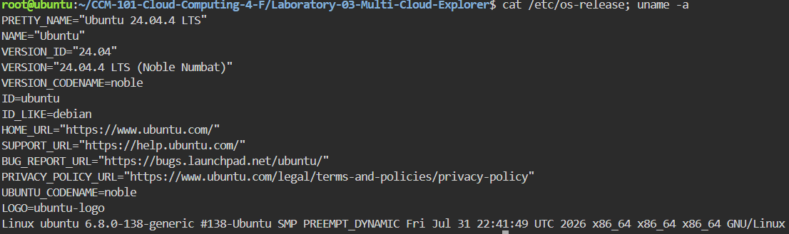
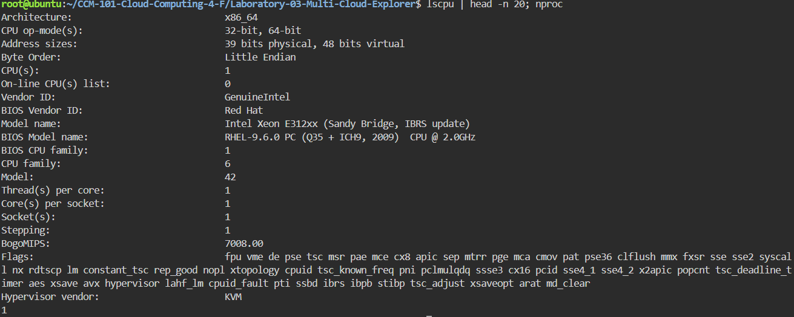
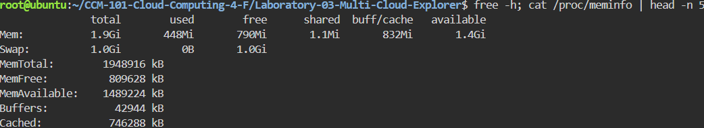
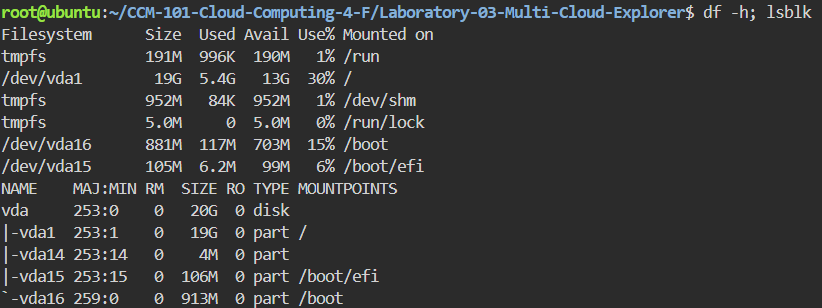

# Lab 03 - Linux Investigation

## 1. OS
Ubuntu 24.04.4 LTS Noble, Kernel 6.8.0-138-generic x86_64, KVM

## 2. CPU
1 vCPU Intel Xeon E312xx Sandy Bridge @2.0GHz, 1 socket/1 core

## 3. Memory
1.9Gi total, ~474Mi used, 1.4Gi available + 1.0Gi Swap

## 4. Disk
20GB vda: 19G / (30% used, 5.4G used) + /boot + efi

## 5. Cloud Migration
- AWS EC2 (t3.small + 20GB gp3 EBS + VPC) because 2 vCPU/2GB matches 1 vCPU/1.9GB lab with burst headroom, cheapest general-purpose.
- Azure VMs (B1ms + 20GB Standard SSD + VNet) because 1 vCPU/2GB burstable is the exact match for this idle 1.9GB box at lowest cost.
- GCP Compute Engine (e2-small + 20GB pd-balanced + VPC) because 2 vCPU/2GB shared-core mirrors the lab and stays in always-free-eligible family.
