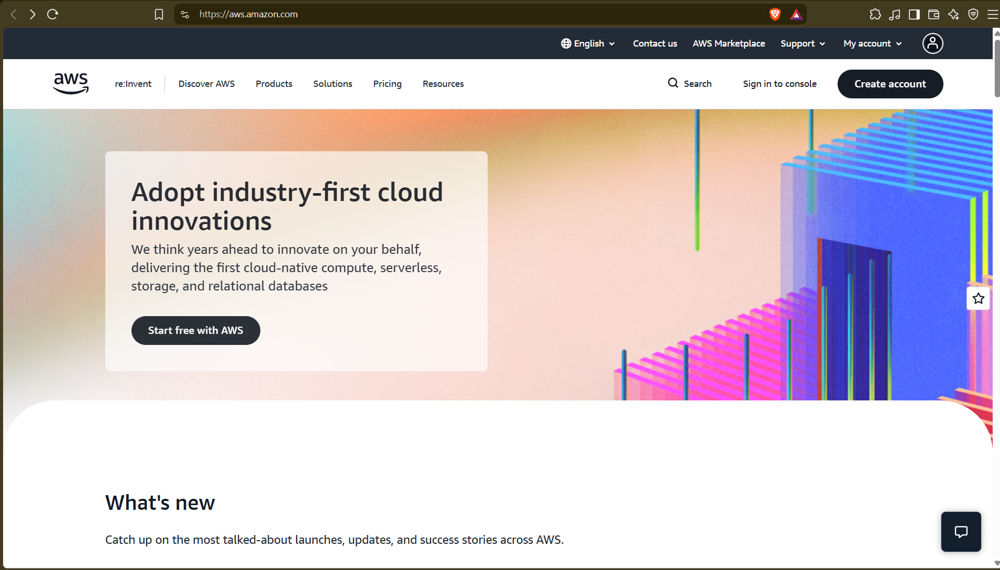

# AWS Research

## 1. Brief Overview

Amazon Web Services (AWS) is the cloud division of Amazon, launched spring 2006 with S3 (Mar 14, 2006) and EC2 (Aug 2006).

In my words: world's most comprehensive/broadly adopted cloud with 200+ services for compute, storage, DB, networking, AI/security, used by startups, enterprises and governments to cut cost, scale and innovate.

## 2. Global Infrastructure

Seen at aws.amazon.com/about-aws/global-infrastructure:

- 39 Regions, 124 Availability Zones, 750+ CloudFront POPs + 15 Regional edge caches, 46 Local/Wavelength Zones. Plans: +7 AZs +2 Regions (Saudi Arabia, Chile). ~20M km private fiber.
- Region: separate geographic area, e.g. us-east-1. Independent for compliance/residency.
- AZ: 1+ isolated datacenters inside a Region, min 3 per Region, independent power/cooling/net, low-latency encrypted links. Spread across AZs = high availability.
- Edge Location: CDN cache for CloudFront/Route 53/Shield, close to users for low latency, not a full region.

## 3. Cloud Management Console

Console: https://console.aws.amazon.com - web UI for all services.

What you can do: search/launch services, create/manage EC2/S3/VPC/RDS visually, manage Billing + IAM users/roles, monitor via widgets/CloudWatch/Health, run CLI via CloudShell, ask Amazon Q.

## 4. Four Core Services

- Compute: EC2 - resizable virtual servers for any workload.
- Storage: S3 - unlimited object storage, 11x9s durability across 3+ AZs.
- Networking: VPC - private network with subnets, route tables, security groups. Delivery: CloudFront CDN.
- Database/Identity: RDS / IAM - managed MySQL/Postgres/Aurora with Multi-AZ. IAM controls users/roles/policies globally.

## 5. Three Advantages

1. Pay-as-you-go, no upfront, scale to zero with Free Tier/Savings Plans.
2. Elastic + global: scale to thousands in minutes, 39 regions for latency/DR.
3. Breadth + security/reliability: 200+ integrated services, 3+ AZs per region, most secure cloud, 15yr Gartner Leader.

## 6. Typical Enterprise Use Cases

1. Web/SaaS hosting + migration: EC2+RDS+ELB with Auto Scaling.
2. Backup/DR: S3/Glacier + Multi-AZ/Multi-Region replication.
3. Analytics/AI: S3 + Athena/Redshift/SageMaker/Bedrock.

## Sources

Accessed: 2026-09-04

- https://aws.amazon.com/what-is-aws/
- https://aws.amazon.com/about-aws/our-origins/
- https://aws.amazon.com/about-aws/global-infrastructure/
- https://docs.aws.amazon.com/awsconsolehelpdocs/latest/gsg/what-is.html
- https://docs.aws.amazon.com/
