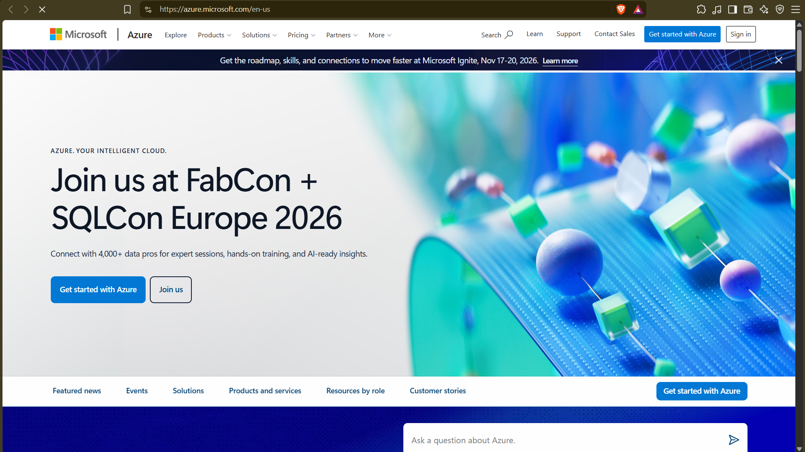

# Azure Research

## 1. Brief Overview - who runs it, launch year, what it's known for

Microsoft runs Microsoft Azure. Announced Oct 2008 as Windows Azure (Project Red Dog), GA Feb 1, 2010, renamed Microsoft Azure Mar 25, 2014.

In my words: Microsoft's cloud with 600+ services. Known as the enterprise/hybrid cloud, best for Windows/.NET/SQL Server/Active Directory/Microsoft 365 shops, and now AI via Azure OpenAI.

## 2. Global Infrastructure - # Regions/AZs you saw, what is Region/AZ/paired region

Seen Sept 2026: 60+ active regions, 70+ announced, 500+ datacenters. ~47 global regions listed, 37 with AZs. Largest footprint of any cloud.

- Region: Set of datacenters in one place, e.g. East US, West Europe. Fixes data-residency, latency, price.
- AZ: Separate datacenter groups inside one region with independent power/cooling/network, usually 3 per region. Deploy across 2+ zones = survive datacenter loss.
- Paired region: Two regions in same geography linked by Microsoft, e.g. East US <-> West US, Japan East <-> Japan West. Used for geo-replication, sequential updates, recovery priority. Not all new regions have a pair.

## 3. Portal - 3 things you can do + screenshot

Portal: https://portal.azure.com - unified web console.

1. Create/manage resources: Create a resource, start/stop/resize VMs, create DBs, move/lock/tag resources.
2. Monitor/control cost: Overview metrics, Activity Log, Alerts, Cost Management, custom dashboards.
3. Secure/govern: RBAC, Entra ID access, Cloud Shell, support tickets.

## 4. Four Core Services - 1 line each: VM, Blob/VNet/SQL or Entra

- Compute - Azure Virtual Machines: On-demand Linux/Windows VMs with full OS control, scale sets for auto-scale.
- Storage - Azure Blob Storage: Scalable object storage for unstructured data with geo-replication.
- Networking - Azure Virtual Network (VNet): Private network with subnets, NSGs, peering, VPN/ExpressRoute.
- Database/Identity - Azure SQL Database / Microsoft Entra ID: Managed SQL Server as a service. Entra ID (ex-Azure AD) for SSO, RBAC, Conditional Access.

## 5. Three Advantages

1. Best for Microsoft stacks: Same login for M365 + Azure, easy .NET/SQL/Windows migration.
2. Hybrid + compliance: Arc, ExpressRoute, sovereign clouds, paired regions for DR.
3. Global scale + AI: 70+ regions with zones, PaaS to Kubernetes, OpenAI integration.

## 6. Use Cases - especially Microsoft-stack shops

1. Lift-and-shift Windows/.NET/SQL Server to VMs/SQL Managed Instance/App Service with Entra ID.
2. Hybrid M365 intranet with single sign-on, on-prem DB + Azure burst.
3. Data + AI: Data Lake + Synapse/Fabric + Azure OpenAI chat over company data.

## Sources - list URLs + accessed date

Accessed: 2026-09-04

- https://azure.microsoft.com/en-us/explore/global-infrastructure
- https://learn.microsoft.com/en-us/azure/reliability/regions-overview
- https://learn.microsoft.com/en-us/azure/reliability/regions-list
- https://learn.microsoft.com/en-us/azure/reliability/availability-zones-overview
- https://learn.microsoft.com/en-us/azure/reliability/regions-paired
- https://learn.microsoft.com/en-us/azure/azure-portal/azure-portal-overview
- https://learn.microsoft.com/en-us/azure/virtual-machines/overview
- https://azure.microsoft.com/en-us/products/storage/blobs/
- https://en.wikipedia.org/wiki/Microsoft_Azure
