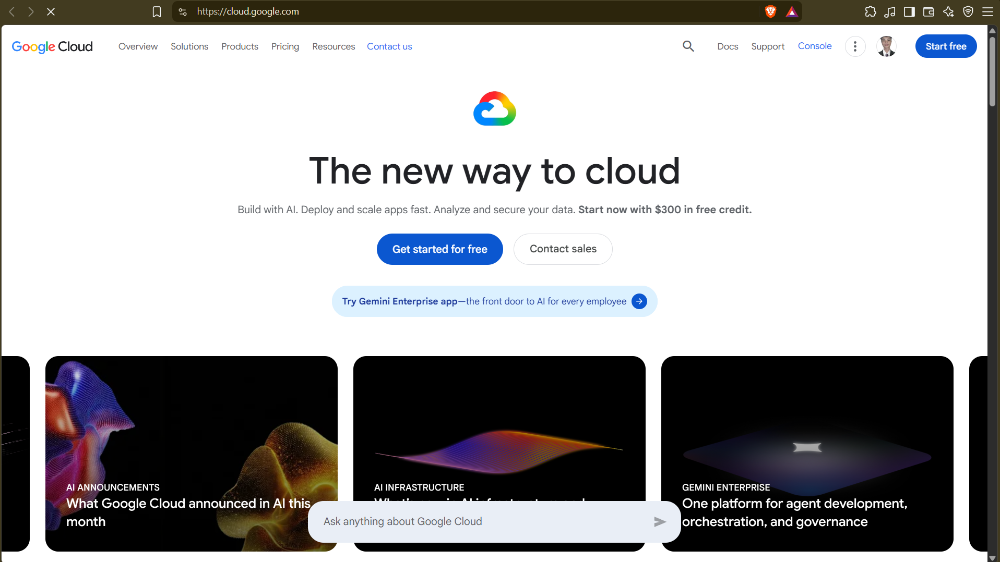

# GCP Research

## 1. Brief Overview

Google runs Google Cloud Platform (GCP). Started 2008 as App Engine preview, GA 2011.

In my words: Google's cloud, built on the same infra as Search/YouTube. Known for Kubernetes (Google created it), BigQuery data warehouse, and AI/ML (Gemini, Vertex AI). Strong in data, open source, and pay-as-you-go simplicity.

## 2. Global Infrastructure

Seen at cloud.google.com/about/locations:

- 40+ regions, 120+ zones across Asia, Australia, Europe, Africa, Middle East, North + South America, plus 200+ Cloud CDN edge locations.
- Region: independent geographic area, e.g. us-central1, europe-west1, asia-east1. You pick it for latency, residency, price.
- Zone: isolated deployment area inside a region, e.g. asia-east1-a/b/c. Typically 3 zones per region, high-bandwidth low-latency links between them. VMs/disks are zonal, IPs are regional, VPC/images are global. Spread across zones = survive datacenter failure. Edge points = Cloud CDN caches content close to users.

## 3. Cloud Console

Console: https://console.cloud.google.com - web UI to manage projects/resources.

1. Create/manage: launch VMs, buckets, SQL, GKE clusters, guided wizards + Cloud Shell browser CLI.
2. Monitor/control: Cloud Hub unified view of health, costs, quotas, tickets, Billing + Observability dashboards.
3. Secure/govern: IAM granular roles per project/resource/service-account, enable APIs, support.

## 4. Four Core Services

- Compute - Compute Engine: Custom VMs in Google datacenters for any workload.
- Storage - Cloud Storage: Secure, durable object storage for any amount of data, Standard/Nearline/Coldline/Archive tiers.
- Networking - Virtual Private Cloud (VPC): Single global VPC per org, custom subnets + firewall, no need to peer across regions.
- Database/Identity - Cloud SQL / Cloud IAM: Managed MySQL/Postgres/SQL Server with HA/backups. IAM for granular roles + service accounts to control who can do what.

## 5. Three Advantages

1. Data + AI first: BigQuery serverless analytics + Vertex/Gemini built-in, same network Google uses.
2. Simple global networking: global VPC + load balancing + Cloud CDN, less cross-region plumbing.
3. Open + cost-friendly: Kubernetes-native, sustained-use/automatic discounts, $300 free trial + 20+ always-free products.

## 6. Typical Use Cases

1. Container modernization: GKE/Cloud Run to run microservices that auto-scale.
2. Analytics + AI: BigQuery + Looker + Vertex to query TBs with SQL and add predictions/chat.
3. Web/media scale: Cloud Storage + Cloud CDN + Load Balancing for global sites/video.

## Sources + Accessed date

Accessed: 2026-09-04

- https://cloud.google.com/
- https://cloud.google.com/docs/overview
- https://cloud.google.com/docs/geography-and-regions
- https://cloud.google.com/about/locations
- https://cloud.google.com/cloud-console
- https://console.cloud.google.com/ docs
